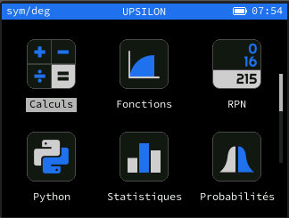
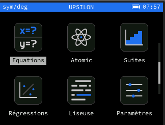
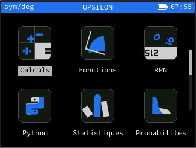
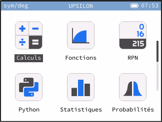
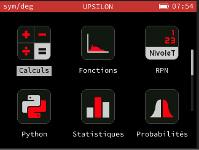

# Upsilon-Themes
It is a simple repo to have dark Upsilon theme.

Bootloader themes are made to be used with bootloader building only !!


## Build
Just  compile [Upsilon](http://github.com/Lauryy06/Upsilon) with this args:
```bash
THEME_NAME=upsilon_dark THEME_REPO=https://github.com/hugo-b-r/Upsilon-Themes.git
```
Don't forget to use username and -j flag if you respectively want to compile with your username and build using multiple threads.


## Gallery

### Upsilon Dark






Command-line options for Omega/Upsilon build:
```bash
THEME_NAME=upsilon_dark THEME_REPO=https://github.com/hugo-b-r/Upsilon-Themes.git
```


### Upsilon Cursed Dark



Command-line options for Omega/Upsilon build:
```bash
THEME_NAME=upsilon_cursed_dark THEME_REPO=https://github.com/hugo-b-r/Upsilon-Themes.git
```


### Upsilon Light Bladeless



Command-line options for Omega/Upsilon build:
```bash
THEME_NAME=upsilon_light_bladeless THEME_REPO=https://github.com/hugo-b-r/Upsilon-Themes.git
```


### Fc-Nivolet Dark



Command-line options for Omega/Upsilon build:
```bash
THEME_NAME=fc-nivolet_dark THEME_REPO=https://github.com/hugo-b-r/Upsilon-Themes.git
```

