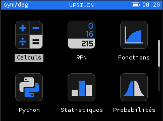
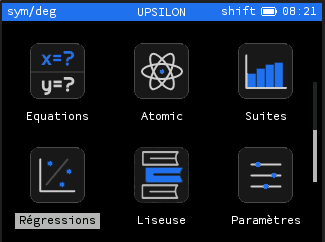
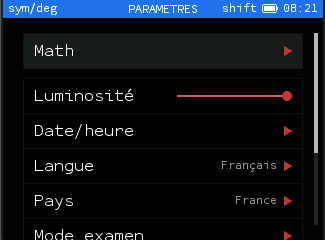

# Upsilon-Themes
It is a simple repo to have dark Upsilon theme.

## Build
Just  compile [Upsilon](http://github.com/Lauryy06/Upsilon) with this args:
```bash
THEME_NAME=upsilon_dark THEME_REPO=https://github.com/lemoustachu/Upsilon-Themes.git
```
Don't forget to use username and -j flag if you respectively want to compile with your username and build using multiple threads.

## Screenshots





